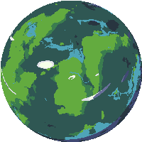

<!---

--->

# Ürün İle İlgili Bilgiler

Speedrun, Pixel, Platformer, [(WebGL) üzerinden oynayabilirsiniz](https://play.unity.com/en/games/192fbe56-6826-4dff-ada9-d010c83667a0/cosmic-rush)

## Takım Elemanları

- Gülsüm Kırvar: Product Owner
- Gülsüm Kırvar: Scrum Master
- Hazar Çakar: Developer
- Gülizar Rabia Çakan: Developer
- Gamze Nur Erdem: Developer

## Ürün İsmi

Cosmic Rush

## Ürün Açıklaması

- Uzay gemisinde oturmaktan sıkılmış 3 uzaylı arkadaş, o sırada yanından geçtikleri gezegenleri keşfetmek için birbirleri arasında, kimin daha hızlı keşfedeceği üzerine iddiaya girerler. Her gezegenin kendi atmosferine göre (oyuncu kontrol) zorluğu vardır. Bakalım sen ne kadar sürede hepsini keşfedebileceksin?

## Ürün Özellikleri

- Pixel
- Platformer
- Speedrun
- 3 Farklı gezegen bölümü
- Her gezegene özel oyuncu kontrol zorluğu

## Hedef Kitle

- 10-35 yaş arası kullanıcılar
- Bilim Kurgu Temasına ilgi duyanlar
- Gamer Komüniteleri ve Forumlar
- Speedrun severler

## Product Backlog URL

[Trello](https://trello.com/b/9zvnilY9/cosmic-rush-from-time-guards)

---

# Sprint 1

- **Sprint Notları**: Oyunun içeriği trello tablosu ile product backlog'ların içine yazılmıştır. Product backlog item'lara tıklandığında oyunun detayları okunabilir.

- **Sprint içinde tamamlanması tahmin edilen puan**: 10 Puan

- **Puan tamamlama mantığı**: Trello tablosunda tamamlanan her görev için 2 puan geçerli olacaktır. Toplamda proje boyunca tamamlanması gereken 30 puanlık backlog bulunmaktadır. 3 sprint'e bölündüğünde ilk sprint'in en azından 10 ile başlaması gerektiğine karar verildi.

- **Daily Scrum**: Daily Scrum toplantılarının zamansal sebeplerden ötürü WhatsApp ve Discord üzerinden yapılmasına karar verilmiştir. Daily Scrum toplantısı örneği aşağıda ekran görüntüsü olarak paylaşılmaktadır.

  - 

    
<strong>📸 Daily Scrum ekran görüntüleri için tıkla!</strong>

    
    
    
    
  

- **Backlog düzeni ve Story seçimleri**: Backlog'umuz ilk yapılacak story'lere göre düzenlenmiştir. Sprint başına tahmin edilen puan sayısını geçmeyecek şekilde sıradan seçimler yapılmaktadır. Story başına çıkan tahmin puanı, toplam puanın yarısından az tutulmuştur. Oyun ile ilgili blacklog düzeni ve story seçimleri trello tablosunda açık bir şekilde belirtilmiştir.

  - 

    
<strong>📸 Sprint Board ekran görüntüleri için tıkla!</strong>

    
    

- **Ürün Durumu:**

İlk Hali | Yenilenmiş Hali
:-: | :-:
<video src="https://github.com/hhhhh-ckr/OUA-Bootcamp-Grup87/assets/85761842/61845bdc-bd8d-43df-b1e0-c1ec8ea19693"></video> | <video src="https://github.com/hhhhh-ckr/OUA-Bootcamp-Grup87/assets/85761842/67e32f68-86fd-4576-bc42-e42124915dad"></video>

- **Sprint Review:**
  - **Alınan kararlar**: Oyunun üretiminin planlı ilerlemesi için ekip üyelerinin her birine 2 adet gezegen tasarımı verilmiştir. Fakat bir yandan da oyunun ilerlemesi için yeterli olmamıştır. O sebeple tasarım dağılımı  bir sonraki sprint'e aktarılmıştır. Çıkan ürünün çalışmasında ve testlerinde bir problem görülmemiştir. Ekstra koyulması gereken özellikler belirlenmiştir.

  - **Sprint Review katılımcıları**: Gülsüm Kırvar, Gülizar Rabia Çakan, Gamze Nur Erdem ve Hazar Çakar

- **Sprint Retrospective:**
  - İletişim ve iş birliği yüksek seviyedeydi.
  - Takım içindeki görev dağılımıyla ilgili düzenleme yapılması kararı alınmıştır.
  - Takım, UI tasarımının başarılı bir şekilde tamamlandığını ve beklentileri   karşıladığını belirtti.
  - Uzay gemisi kontrol mekanikleri için araştırma yapılması gerektiği önerildi.
  - Gezegen tasarımları için 3D assetlerin kullanımını öğrenme istenildi.
  - Tahmin puanları gözden geçirilmeli ve sprint planlama toplantılarında gerekli   geri bildirimlerin developer'lar tarafından verildiğine emin olunmalı.
  - Unit test'ler için ayrılan efor/saat arttırılmalı.

---

# Sprint 2

- **Sprint Notları**: Oyunun içeriği trello tablosu ile product backlog'ların içine yazılmıştır. Product backlog item'lara tıklandığında oyunun detayları okunabilir.

- **Sprint içinde tamamlanması tahmin edilen puan**: 10 Puan

- **Puan tamamlama mantığı**: Trello tablosunda tamamlanan her görev için 2 puan geçerli olacaktır. 3 sprint'e bölündüğünde ikinci sprint'in en azından 10 ile devam etmesi gerektiğine karar verildi.

- **Daily Scrum**: Daily Scrum toplantılarının zamansal sebeplerden ötürü WhatsApp ve Discord üzerinden yapılmasına karar verilmiştir. Daily Scrum toplantısı örneği aşağıda ekran görüntüsü olarak paylaşılmaktadır.

  - 

    
<strong>📸 Daily Scrum ekran görüntüleri için tıkla!</strong>

     
    
  

- **Backlog düzeni ve Story seçimleri**: Backlog'umuz ilk yapılacak story'lere göre düzenlenmiştir. Sprint başına tahmin edilen puan sayısını geçmeyecek şekilde sıradan seçimler yapılmaktadır. Story başına çıkan tahmin puanı, toplam puanın yarısından az tutulmuştur.
oyun ile ilgili blacklog düzeni ve story seçimleri trello tablosunda açık bir şekilde belirtilmiştir.

  - 

    
<strong>📸 Sprint Board ekran görüntüleri için tıkla!</strong>

    

- **Ürün Durumu:**

Yenilenmiş Hali | Bazı Assetler
:-: | :-:
 | 

- **Sprint Review:**
  - **Kod Yazımı**: Oyun mekanikleri kod yazımına başlanmıştır. Hatalı kodlar üzerinde yeniden çalışılarak düzeltmeler yapılmaktadır. Bu süreçte kodun stabilitesini ve performansını artırmak için gerekli tüm iyileştirmeler yapılacaktır.

  - **Gezegen Tasarımları**: Gezegen tasarımlarının bir kısmı tamamlanmıştır. İlk sprint planına göre kullanılacak araçlar bulunmuş olup, gezegen tasarımlarının kalan kısmı üzerinde çalışılmaktadır. Oyunun mekaniği hakkında bazı değişikliklere gidilmiş ve bu değişiklikler doğrultusunda gezegen tasarımları güncellenmiştir.

  - **Harita Çalışmaları**: Şu anda harita üzerinde çalışmalar devam etmektedir. Haritanın oyunculara daha iyi bir oyun deneyimi sunabilmesi için ayrıntılı bir şekilde tasarlanmaktadır. 3D ile ilk defa çalışılacağı için başa çıkabilme durumuna göre 2D tasarıma geçme de söz konusu olup, gerektiğinde uygulanabilecektir.

  - **İş Bölümü**: Grup içinde iş bölümü yapılmış olup, her bir üyenin iki gezegen tasarlaması istenmiştir. Bu şekilde, takım üyeleri arasında görevlerin eşit dağılımı sağlanmış ve tasarım süreci hızlandırılmıştır.

  - **Sprint Review katılımcıları**: Gülsüm Kırvar, Gülizar Rabia Çakan, Gamze Nur Erdem ve Hazar Çakar

- **Sprint Retrospective:**

  - **Neler İyi Gitti?**
    - **Kod Yazımı**: Oyun mekanik kod yazımına başarılı bir şekilde başlandı ve hatalı kodlar üzerinde düzeltmeler yapıldı. Bu süreçte takımın koordinasyonu ve işbirliği oldukça iyiydi.

    - **Gezegen Tasarımları**: Gezegen tasarımlarının bir kısmı başarıyla tamamlandı ve kullanılacak araçlar bulundu. Tasarımlar, oyunun mekanik değişikliklerine uyumlu hale getirildi.

    - **İş Bölümü**: Grup içinde iş bölümü etkili bir şekilde yapıldı. Her bir üyenin iki gezegen tasarlaması kararı, işlerin daha verimli ilerlemesini sağladı.

  - **Neler İyi Gitmedi**:

    - **Kod Yazımı**: Bazı hataların düzeltilmesi beklenenden uzun sürdü, bu da zaman planlamasında aksamalara yol açtı.

    - **Gezegen Tasarımları**: Bazı gezegen tasarımlarının beklenenden uzun sürmesi, projenin diğer aşamalarını etkiledi.

    - **Harita Çalışmaları**: Harita üzerinde yapılan çalışmalar istenilen hızda ilerlemedi ve bu da projenin genel ilerleyişini olumsuz etkiledi.

- **Eylem Planı**:
  - **Test ve İnceleme**: Kod yazımı sırasında otomatik testler ve kod incelemeleri artırılacak.

  - **Planlama**: Tasarım aşamaları için daha realist zaman planlamaları yapılacak ve bu planlamalar düzenli olarak gözden geçirilecek.

  - **İletişim**: Harita çalışmaları ve diğer önemli süreçler için düzenli toplantılar düzenlenecek, ekip içi iletişim artırılacak.

---

# Sprint 3

- **Sprint Notları**: Bu planlar takip edilerek, Cosmic-Rush oyununun son sprintinde tüm hedeflerin başarıyla tamamlanması ve oyunun yayınlanmaya hazır hale getirildi.

- **Sprint içinde tamamlanması tahmin edilen puan**: 10 Puan

- **Puan tamamlama mantığı**: Trello tablosunda tamamlanan her görev için 2 puan geçerli olacaktır. 3 sprint'e bölündüğünde ikinci sprint'in en azından 10 ile devam etmesi gerektiğine karar verildi.

- **Daily Scrum**: Daily Scrum toplantılarının zamansal sebeplerden ötürü WhatsApp ve Discord üzerinden yapılmasına karar verilmiştir. Daily Scrum toplantısı örneği aşağıda ekran görüntüsü olarak paylaşılmaktadır.

  - 

    
<strong>📸 Daily Scrum ekran görüntüleri için tıkla!</strong>

    
  

- **Backlog düzeni ve Story seçimleri**: Backlog'umuz ilk yapılacak story'lere göre düzenlenmiştir. Sprint başına tahmin edilen puan sayısını geçmeyecek şekilde sıradan seçimler yapılmaktadır. Story başına çıkan tahmin puanı, toplam puanın yarısından az tutulmuştur.
oyun ile ilgili blacklog düzeni ve story seçimleri trello tablosunda açık bir şekilde belirtilmiştir.

  - 

    
<strong>📸 Sprint Board ekran görüntüleri için tıkla!</strong>

    

- **Ürün Durumu:**

Gezegen Tasarımları | Bölüm Tasarımları
:-: | :-:
   |   
Oynanış videosu | Oyun bitiş sahnesi
 | 

- **Sprint Review:**

  - **Yapılan Genel Olaylar**: Sprint boyunca tamamlanan işlerin gözden geçirilmesi, demo yapılması ve geri bildirim toplanıp Build alınması

  - **Sprint Review katılımcıları**: Gülsüm Kırvar, Gülizar Rabia Çakan, Gamze Nur Erdem ve Hazar Çakar

- **Sprint Retrospective:** Sprint boyunca neyin iyi gittiğini, neyin geliştirilebileceğini ve gelecekteki projelerde neleri iyileştirebileceğimizi tartışmak.

  - **Neler İyi Gitti?**
    - **Kod Yazımı**: Oyuncu kontrol kodu vb. kodlar tamamlandı. Bu süreçte takımın koordinasyonu ve işbirliği yeterince iyiydi.

    - **İş Bölümü**: Grup içinde iş bölümü etkili bir şekilde yapıldı. Oy birliği ile 8 gezegen sayısı düşürülüp, 3 gezegen tasarımına karar kılındı ve başarıyla görev yerine getirildi. İşlerin daha verimli ilerlemesini sağladı.

    - **Gezegen Tasarımları**: Gezegen tasarımları 3D yerine 2D yapılmasına karar verildiği için TileMap kullanarak Gezegen bölümleri tasarlandı.

  - **Neler İyi Gitmedi**:

    - **Kod Yazımı**: Oyunu bir kere bitirdikten sonra süre sayacının durmama sorunu giderilmeye çalışıldı ama başarısız olundu.

    - **Harita Çalışmaları**: Harita üzerinde yapılan çalışmalar istenilen hızda ilerlemedi ve bu da projenin 2D olarak yapılmasına olanak sağladı. Ayrıca TileMap kullanıldığı için render konusunda bozukluklar giderilmeye çalışıldı ama sorun çözülemedi.

- **Test Planı**:
  - **Unit Testleri**: Gezegenler arası geçiş ve oyun sonu süre hesaplama testleri oluşturma.

  - **Kullanıcı Kabul Testleri**: Oyuncu etkileşimleri ve UI'nın oyuncular tarafından test edilmesi.

  - **Performans Testleri**: Oyun performansının farklı cihazlarda test edilmesi.
